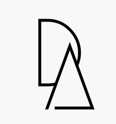

 
  <h3><b>HTML, CSS and JavaScript Capstone</b></h3>

# 📗 Table of Contents

- [📖 About the Project](#about-project)
  - [🛠 Built With](#built-with)
    - [Tech Stack](#tech-stack)
    - [Key Features](#key-features)
  - [🚀 Live Demo](#live-demo)
  - [🚀 Live Video](#live-video)
  - [Project Outline](#project-outline)
- [💻 Getting Started](#getting-started)
  - [Setup](#setup)
  - [Prerequisites](#prerequisites)
  - [Install](#install)
  - [Usage](#usage)
  - [Run tests](#run-tests)
  - [Deployment](#deployment)
- [👥 Authors](#authors)
- [🔭 Future Features](#future-features)
- [🤝 Contributing](#contributing)
- [⭐️ Show your support](#support)
- [🙏 Acknowledgements](#acknowledgements)
- [📝 License](#license)

# 📖 <a name="about-project">HTML, CSS and JavaScript Capstone</a>

**[HTML, CSS and JavaScript Capstone]** is aN HTML, CSS and JavaScript prject to showcase my HTML, CSS, JavaScript and GitHub Knowledge

## 🛠 Built With 

HTML,CSS and Javascript

### Tech Stack 

  
HTML

  
CSS

  
JavaScript

Visual Code IDE

<!-- Features -->

### Key Features 

- **[Mobile and Desktop Versions Deployed]**
- **[Mobile Menu Deployed With Java Script]**
- **[Mobile and Desktop Versions Deployed]**
- **[Speakers Section Populated with JavaScript]**

(<a href="#readme-top">back to top</a>)

## 🚀 Live Demo 

For Live demo click
<a href="https://demesameneshoa.github.io/First-Capstone-Project/"> here </a>

## 🚀 Live Video 

For Live video presentation click
<a href="https://drive.google.com/file/d/1DU4Ztuus3DhZsPDoy4M3SSuC9o45j9Qn/view?usp=sharing"> here </a>

## 💻 Getting Started 

To get a local copy up and running, follow these steps.

### Prerequisites

In order to run this project you need:
A web browser installed

### Setup

Clone this repository to your desired folder:

### Install

No installation Required

### Usage

To run the project, execute the following command:

### Run tests

No Tests Required

### Deployment

You can deploy this project using:

(<a href="#readme-top">back to top</a>)

## 👥 Authors 

👤 **Demes Ameneshoa**

- GitHub: [@githubhandle](https://github.com/demesameneshoa)

(<a href="#readme-top">back to top</a>)

## 🔭 Future Features 

- Including Additional Responsiveness Screen BreakPoints

(<a href="#readme-top">back to top</a>)

## 🤝 Contributing 

Contributions, issues, and feature requests are welcome!

(<a href="#readme-top">back to top</a>)

## ⭐️ Show your support 

If you like this project Please Rate IT!

(<a href="#readme-top">back to top</a>)

## 🙏 Acknowledgments 

I would like to acknowledge <a href="https://www.behance.net/adagio07">Cindy Shin</a> who is the author of the original <a href="https://www.behance.net/gallery/29845175/CC-Global-Summit-2015"> design</a> which is required by the <a href=" https://creativecommons.org/licenses/ ">Creative Commons License</a>
I would like to thank everyone at Miroverse

(<a href="#readme-top">back to top</a>)

## 📝 License 

This project is [MIT](./MIT.md) licensed.

(<a href="#readme-top">back to top</a>)

